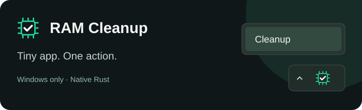

# RAM Cleanup

**A ridiculously small RAM cleaner for Windows 10/11 x64.** Native Rust, a tray icon, and one action: **right-click → Cleanup**. No window, timers, polling, background service or automatic cleaning.

**[Download the installer](https://github.com/matej-kaska/ramcleanup/releases/latest/download/RAMCleanup-Setup.exe)** · [Releases](https://github.com/matej-kaska/ramcleanup/releases)

Install once, approve UAC, and the tray starts immediately. Setup has an optional **Start RAM Cleanup with Windows** checkbox. Cleaning runs through a short-lived privileged worker; the tray uses normal user rights.

It performs the Windows operations behind [Microsoft RAMMap](https://learn.microsoft.com/en-us/sysinternals/downloads/rammap)'s **Empty** menu: working sets, system file cache, modified pages and standby memory. RAMMap is not required or bundled. Cleaning is manual; Windows can reuse the freed memory and reload trimmed pages.

| Measured footprint | Windows 11 x64, fresh start, 60 seconds idle |
|---|---:|
| Tray executable | 32 KiB |
| On-demand helper | 13 KiB |
| Installer | ~104 KiB |
| Private resident RAM | 116 KiB |
| Total resident RAM | 316 KiB |
| Private commit | 0.92 MiB |
| CPU time / reads / writes during sample | 0 ms / 0 B / 0 B |

Measured on one machine; Windows and interaction change these values. Reproduce with `python scripts/measure-memory.py <PID> --seconds 60`.

Build on Windows with Rust, MSVC + Windows SDK and NSIS: `./scripts/build.ps1 -Installer -Check`. Pushing a matching `vX.Y.Z` tag publishes an installer and SHA-256 checksum through GitHub Actions.

Public domain ([Unlicense](LICENSE)). [Third-party notices](THIRD-PARTY-NOTICES.txt).
